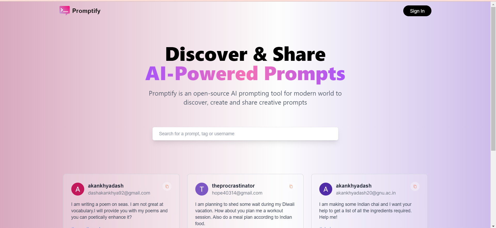
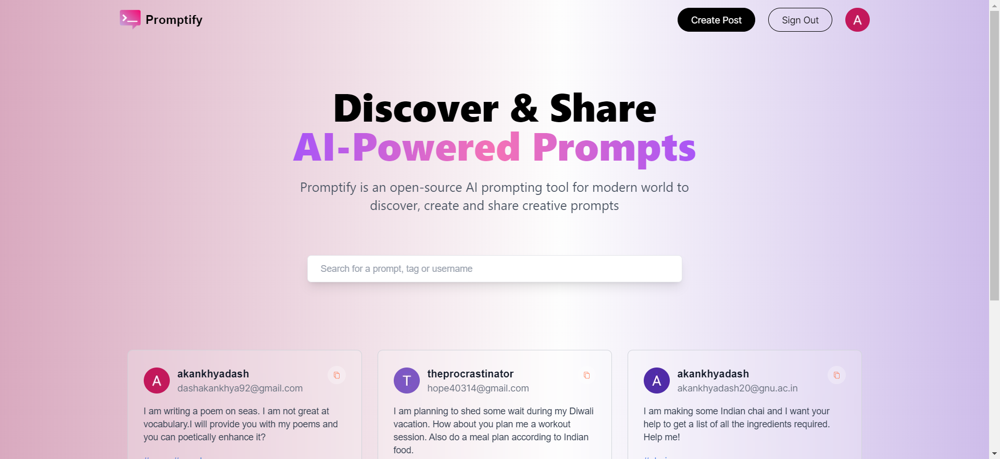
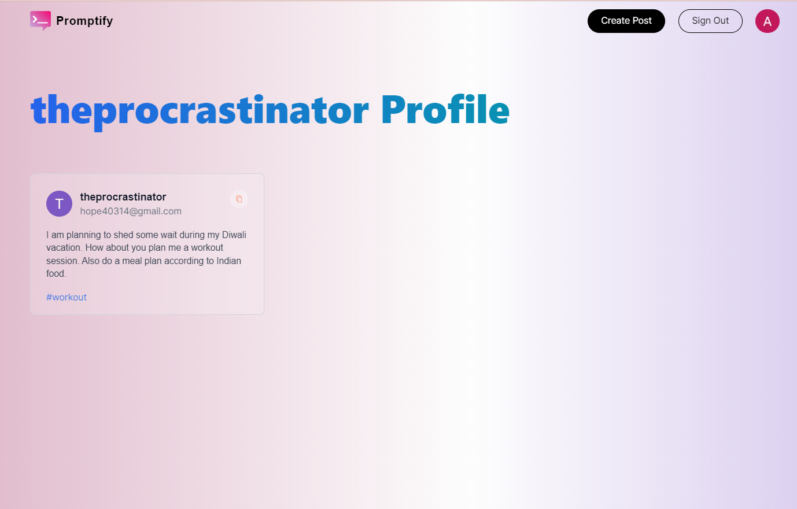
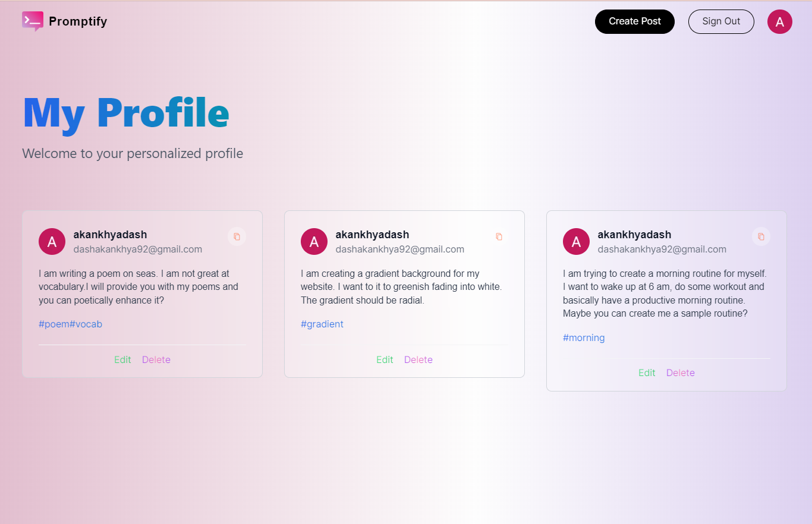
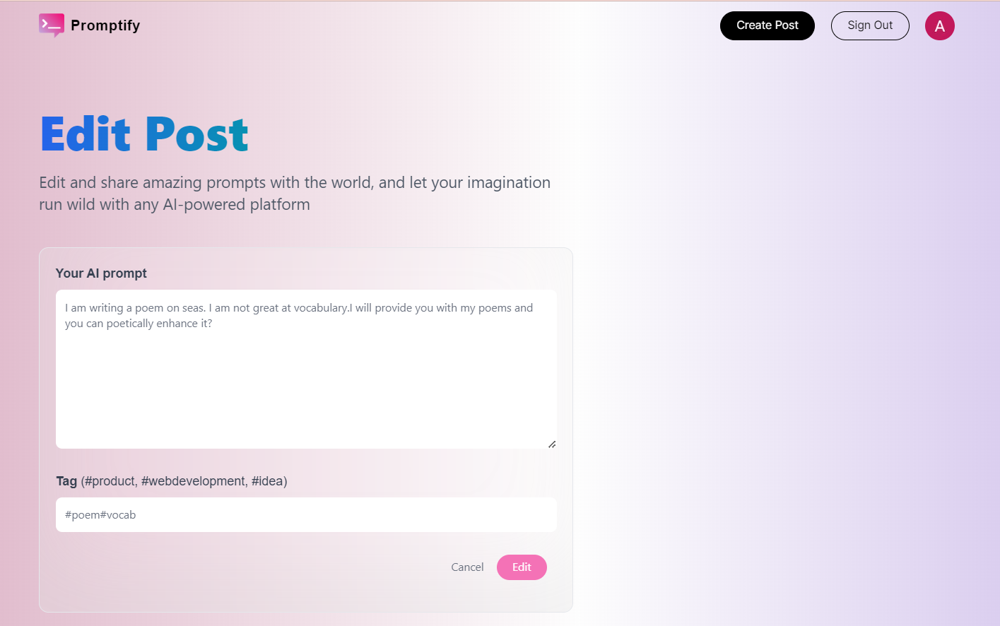

## Promptopia

Promptify is a NextJS application where the user can create, view, update and delete prompts. The user can also view other people's profile where their prompts will be displayed. The application also provides search functionality allowing user to search by prompts, usernames and tags.

## Tech Stack
- NextJS
- TailwindCSS
- MongoDB

## Screenshots

# Home Page

# Home Page (after login)

# Create Post
<video src="create_post_promptify.mp4" controls title="Title"></video>

# View Profile

# Viewing your own profile

# Editing Your Post

# Deleting Your Post
<video src="delete_post_promptify.mp4" controls title="Title"></video>

## Installation

1. Clone the repo
> git clone 
> cd promptify
2. Install dependencies
npm install
3. In .env file, place your mongodb url
4. Go to console.google.com, create your OAuth client credentials and add them to .env file
5. Also add nextauth url, nextauth auth internal url and nextauth secret.
6. Run the application locally.
> npm run dev

## Credits
I have used the following YouTube video to create this project.
https://www.youtube.com/watch?v=wm5gMKuwSYk&t=11467s&ab_channel=JavaScriptMastery